# UI to UI-Native Migration Strategy

## Overview

This document outlines the systematic process for migrating UI components from the web-based UI library to the React Native UI-native library, ensuring visual parity and functional consistency.

## Component Dependency Graph

The following diagram shows the dependency relationships between all UI components in the library:

```mermaid
graph TD
    %% Core Foundation Layer
    subgraph "Foundation Layer"
        RN[React Native<br/>View, Text, Pressable, Image, etc.]
        CVA[class-variance-authority<br/>Component Variants]
        TW[Tailwind/NativeWind<br/>Styling System]
        Utils[Utils<br/>cn, fonts]
    end

    %% Icon System
    subgraph "Icon System"
        IconTypes[Icon Types<br/>IconProps, DirectionalIconProps]
        IconUtils[Icon Utils<br/>iconVariants]
        
        subgraph "Icon Categories"
            BadgeIcons[Badge Icons<br/>Bronze, Gold, Silver, etc.]
            BrandIcons[Brand Icons<br/>Apple, Ethereum, Starknet, etc.]
            BrandColorIcons[Brand Color Icons<br/>Argent, Cartridge, Discord, etc.]
            DirectionalIcons[Directional Icons<br/>Arrow, Carat, Wedge, etc.]
            StateIcons[State Icons<br/>Bell, Bolt, Book, etc.]
            UtilityIcons[Utility Icons<br/>Check, Copy, Dots, Spinner, etc.]
        end
    end

    %% Primitive Components
    subgraph "Primitive Components"
        Text[Text<br/>Base text component]
        Button[Button<br/>Interactive element]
        Input[Input<br/>Text input with validation]
        Textarea[Textarea<br/>Multi-line text input]
        Card[Card<br/>Container with header/content]
        Badge[Badge<br/>Status indicator]
        Separator[Separator<br/>Visual divider]
        Skeleton[Skeleton<br/>Loading placeholder]
        Spinner[Spinner<br/>Loading indicator]
        Label[Label<br/>Form labels]
        
        %% Additional UI Primitives
        Accordion[Accordion]
        AlertDialog[Alert Dialog]
        Alert[Alert]
        AspectRatio[Aspect Ratio]
        Breadcrumb[Breadcrumb]
        Checkbox[Checkbox]
        Command[Command]
        Dialog[Dialog]
        Drawer[Drawer]
        DropdownMenu[Dropdown Menu]
        Menubar[Menubar]
        Popover[Popover]
        Progress[Progress]
        RadioGroup[Radio Group]
        Select[Select]
        Sheet[Sheet]
        Switch[Switch]
        Table[Table]
        Tabs[Tabs]
        Toast[Toast]
        Tooltip[Tooltip]
        Toggle[Toggle]
        ToggleGroup[Toggle Group]
    end

    %% Typography System
    subgraph "Typography"
        TextClassContext[Text Class Context<br/>Styling context]
        MonoText[Mono Typography<br/>Monospace text variants]
        SansText[Sans Typography<br/>Sans-serif text variants]
    end

    %% Module Components
    subgraph "Module Components"
        subgraph "Activities"
            ActivityCard[Activity Card]
            ActivityDetail[Activity Detail]
            ActivityHeader[Activity Header]
        end
        
        subgraph "Achievements"
            AchievementCard[Achievement Card]
            AchievementPin[Achievement Pin]
            AchievementProgress[Achievement Progress]
            PlayerAvatar[Player Avatar]
            PlayerBadge[Player Badge]
        end
        
        subgraph "Arcade"
            GameHeader[Game Header]
            GameSelect[Game Select]
            MenuButton[Menu Button]
            MenuItem[Menu Item]
        end
        
        subgraph "Collectibles"
            CollectibleCard[Collectible Card]
            CollectiblePreview[Collectible Preview]
            CollectibleProperties[Collectible Properties]
        end
        
        subgraph "Amount/Tokens"
            AmountInput[Amount Input]
            TokenBalance[Token Balance]
            TokenSelect[Token Select]
        end
        
        subgraph "Layout"
            Header[Header]
            Container[Container]
            BottomTabs[Bottom Tabs]
        end
    end

    %% Dependencies - Foundation
    IconTypes --> Utils
    IconUtils --> CVA
    IconUtils --> Utils
    BadgeIcons --> IconTypes
    BadgeIcons --> IconUtils
    BrandIcons --> IconTypes
    BrandIcons --> IconUtils
    BrandColorIcons --> IconTypes
    BrandColorIcons --> IconUtils
    DirectionalIcons --> IconTypes
    DirectionalIcons --> IconUtils
    StateIcons --> IconTypes
    StateIcons --> IconUtils
    UtilityIcons --> IconTypes
    UtilityIcons --> IconUtils

    %% Dependencies - Primitives
    Text --> RN
    Text --> Utils
    TextClassContext --> Text
    
    Button --> RN
    Button --> CVA
    Button --> Utils
    Button --> UtilityIcons
    Button --> Spinner
    Button --> TextClassContext
    
    Input --> RN
    Input --> CVA
    Input --> Utils
    Input --> UtilityIcons
    
    Textarea --> RN
    Textarea --> CVA
    Textarea --> Utils
    Textarea --> UtilityIcons
    
    Card --> RN
    Card --> Utils
    
    Badge --> RN
    Badge --> CVA
    Badge --> Utils
    
    Spinner --> RN
    Spinner --> Utils
    Spinner --> UtilityIcons
    
    %% Complex Component Dependencies
    Select --> UtilityIcons
    DropdownMenu --> UtilityIcons
    Command --> UtilityIcons
    Command --> Dialog
    Toast --> UtilityIcons
    Sheet --> UtilityIcons
    
    %% Module Dependencies
    ActivityCard --> Card
    ActivityCard --> Badge
    ActivityCard --> BrandColorIcons
    
    AchievementCard --> Card
    AchievementCard --> Badge
    AchievementCard --> BadgeIcons
    
    GameHeader --> Header
    GameHeader --> Button
    GameHeader --> BrandIcons
    
    CollectibleCard --> Card
    CollectibleCard --> Button
    CollectibleCard --> UtilityIcons
    
    AmountInput --> Input
    AmountInput --> Button
    AmountInput --> UtilityIcons
    
    TokenSelect --> Select
    TokenSelect --> BrandColorIcons
    
    Header --> Button
    Header --> BrandIcons
    
    %% Typography Dependencies
    MonoText --> Text
    SansText --> Text

    %% Styling with better contrast
    classDef foundation fill:#1e3a8a,stroke:#1e40af,stroke-width:2px,color:#ffffff
    classDef icons fill:#7c3aed,stroke:#8b5cf6,stroke-width:2px,color:#ffffff
    classDef primitives fill:#059669,stroke:#10b981,stroke-width:2px,color:#ffffff
    classDef modules fill:#dc2626,stroke:#ef4444,stroke-width:2px,color:#ffffff
    classDef typography fill:#be185d,stroke:#ec4899,stroke-width:2px,color:#ffffff
    
    class RN,CVA,TW,Utils foundation
    class IconTypes,IconUtils,BadgeIcons,BrandIcons,BrandColorIcons,DirectionalIcons,StateIcons,UtilityIcons icons
    class Text,Button,Input,Textarea,Card,Badge,Separator,Skeleton,Spinner,Label,Accordion,AlertDialog,Alert,AspectRatio,Breadcrumb,Checkbox,Command,Dialog,Drawer,DropdownMenu,Menubar,Popover,Progress,RadioGroup,Select,Sheet,Switch,Table,Tabs,Toast,Tooltip,Toggle,ToggleGroup primitives
    class ActivityCard,ActivityDetail,ActivityHeader,AchievementCard,AchievementPin,AchievementProgress,PlayerAvatar,PlayerBadge,GameHeader,GameSelect,MenuButton,MenuItem,CollectibleCard,CollectiblePreview,CollectibleProperties,AmountInput,TokenBalance,TokenSelect,Header,Container,BottomTabs modules
    class TextClassContext,MonoText,SansText typography
```



### Component Architecture Overview

The UI library follows a well-structured layered architecture:

- **Foundation Layer** (Blue): React Native primitives, styling system, and utilities
- **Icon System** (Purple): 100+ icons organized by category with shared infrastructure
- **Primitive Components** (Green): 35+ core building blocks for forms, layout, and feedback
- **Module Components** (Red): 15+ specialized components for specific use cases
- **Typography System** (Pink): Text components with context-based styling

### Migration Order Recommendations

Based on the dependency graph, migrate components in this order:

1. **Foundation & Utils** - Ensure core utilities and styling are working
2. **Icon System** - Migrate icon types, utilities, and all icon categories
3. **Typography** - Set up text components and context
4. **Basic Primitives** - Text, Button, Card, Badge, Separator, etc.
5. **Form Primitives** - Input, Textarea, Checkbox, Select, etc.
6. **Complex Primitives** - Dialog, Sheet, Command, Toast, etc.
7. **Module Components** - Activities, Achievements, Arcade, etc.

## Goals

- **Visual Parity**: Achieve 99%+ visual similarity between UI and UI-native components
- **Functional Consistency**: Ensure components behave identically across platforms
- **Systematic Approach**: Follow a repeatable process for each component
- **Quality Assurance**: Use automated tools to verify migration success

## Tools

### 1. NativeWind Setup
NativeWind enables using Tailwind CSS classes directly in React Native components, eliminating the need for style prop conversions.

**Key Benefits**:
- Keep existing Tailwind classes unchanged
- Maintain design system consistency
- Simplify migration process
- Support for responsive design and theme switching

**Configuration Requirements**:
- Ensure `tailwind.config.js` is properly configured for React Native
- Verify custom theme colors from `dark.css` are mapped to Tailwind classes
- Map CSS custom properties (--background-100, --foreground, etc.) to Tailwind color tokens
- Check that all Tailwind plugins are compatible with NativeWind

**React Native vs Web Differences**:
React Native has different default behaviors that require Tailwind class adjustments:

| Web Behavior | React Native Behavior | Class Adjustment |
|--------------|----------------------|------------------|
| `flex` defaults to `flex-direction: row` | `flex` defaults to `flex-direction: column` | `flex` → `flex-row` |
| `flex-col` explicit column direction | `flex` already defaults to column | `flex-col` → `flex` (optional) |
| `position: relative` is default | No default positioning | May need explicit `relative` |
| `box-sizing: border-box` default | Different box model | Check padding/border interactions |
| `overflow: visible` default | `overflow: hidden` default | May need `overflow-visible` |

**Color System**:
The UI library uses CSS custom properties defined in `dark.css` for theming:
- Background colors: `--background-100` through `--background-500`
- Foreground colors: `--foreground`, `--foreground-100` through `--foreground-400`
- Translucent variants: `--translucent-dark-*` and `--translucent-light-*`
- Spacer color: `--spacer-100`

These map to Tailwind classes like:
- `bg-background-100`, `bg-background-200`, etc.
- `text-foreground`, `text-foreground-200`, etc.
- `bg-translucent-dark-100`, `bg-translucent-light-150`, etc.

### 2. Snapshot Update Tool
```bash
# Update all snapshots
pnpm screenshots:update

# Update specific component snapshots
pnpm screenshots:update achievement
pnpm screenshots:update button
pnpm screenshots:update "activities.*card"
```

### 3. Visual Comparison Tool
```bash
# Compare specific snapshots
pnpm screenshots:compare achievement
pnpm screenshots:compare button

# List all available snapshots
pnpm screenshots:compare --list

# Get help
pnpm screenshots:compare --help
```

## Migration Process

### Phase 1: Discovery and Assessment

#### Step 1: Identify Target Component
1. Open the UI library's `__image_snapshots__` directory
2. Browse available snapshots to identify components to migrate
3. Prioritize based on:
   - Component complexity
   - Usage frequency
   - Dependencies on other components

#### Step 2: Check Migration Status
```bash
# List all snapshots and their migration status
pnpm screenshots:summary
```

Look for:
- ✅ Components with matching snapshots (ready for comparison)
- ❌ Components missing in UI-native (need implementation)
- 🔶 UI-native only components (may need review)

### Phase 2: Component Implementation

#### Step 3: Analyze UI Component Structure
1. **Examine the UI component**:
   ```bash
   # Example: examining achievement card
   open ui/src/components/modules/activities/card/achievement-card.tsx
   ```

2. **Identify key elements**:
   - Props interface
   - Component structure
   - Styling approach (Tailwind classes with CSS custom properties)
   - Dependencies (icons, sub-components)
   - Theme integration (check dark.css for color definitions)

3. **Check the story file**:
   ```bash
   open ui/src/components/modules/activities/card/card.stories.tsx
   ```

#### Step 4: Implement UI-Native Component
1. **Create component structure**:
   ```bash
   # Create component directory if needed
   mkdir -p ui-native/components/modules/activities/card
   ```
   
   **Important File Naming Convention**:
   - All new files must use **kebab-case** naming
   - Examples:
     - `achievement-card.tsx` ✅ (not `AchievementCard.tsx` or `achievementCard.tsx`)
     - `button-group.tsx` ✅ (not `ButtonGroup.tsx`)
     - `token-balance.tsx` ✅ (not `TokenBalance.tsx`)

2. **Implement the component**:
   - Keep most Tailwind classes using NativeWind (minimal conversion needed)
   - **Critical**: Convert `flex` to `flex-row` for horizontal layouts
   - Replace HTML elements with React Native equivalents
   - Ensure prop interfaces match exactly
   - Verify theme integration works with NativeWind

3. **Key conversion patterns with NativeWind**:
   ```typescript
   // HTML elements to React Native components
   <div> -> <View>
   <span> -> <Text>
   <p> -> <Text>
    -> <Image>
   <button> -> <Pressable> or custom Button component
   
   // Tailwind class adjustments for React Native defaults
   // Web flex defaults to row, React Native defaults to column
   <div className="flex"> -> <View className="flex-row">
   <div className="flex-col"> -> <View className="flex"> (or <View className="flex-col">)
   
   // Most other classes remain the same
   <span className="text-sm"> -> <Text className="text-sm">
   <div className="bg-background-100"> -> <View className="bg-background-100">
   <div className="text-foreground"> -> <Text className="text-foreground">
   <div className="p-3"> -> <View className="p-3">
   <div className="gap-2"> -> <View className="gap-2">
   ```

4. **Import patterns**:
   ```typescript
   // IMPORTANT: Use subpath imports for utils
   // Web version (relative import)
   import { cn } from "@/utils";
   
   // React Native version (subpath import)
   import { cn } from "#utils";
   
   // This ensures proper path resolution in React Native
   // Configure in package.json:
   // "imports": {
   //   "#utils": "./src/utils/index.ts"
   // }
   ```

   5. **React 19 Considerations**:
   ```typescript
   // IMPORTANT: forwardRef is not required in React 19
   // Old pattern (React 18 and below)
   export const Button = forwardRef<View, ButtonProps>((props, ref) => {
     // component implementation
   });
   
   // New pattern (React 19+)
   export function Button(props: ButtonProps & { ref?: React.Ref<View> }) {
     // component implementation with direct ref usage
   }
   
   // Do NOT use forwardRef when migrating to React 19
   // Refs are now regular props and don't need special handling
   
   // IMPORTANT: Remove displayName from components
   // Old pattern (often used with forwardRef)
   Button.displayName = "Button";
   
   // New pattern - do NOT include displayName
   // Simply export the component without displayName assignment
   
   // IMPORTANT: Prefer function declarations over const assignments
   // Old pattern (const assignment)
   export const Button = (props: ButtonProps) => {
     return <View>...</View>;
   };
   
   // Preferred pattern (function declaration)
   export function Button(props: ButtonProps) {
     return <View>...</View>;
   }
   
   // Exception: Use const when wrapping with memo or other HOCs
   export const Button = memo((props: ButtonProps) => {
     return <View>...</View>;
   });
   ```

#### Step 5: Create Story File
1. **Copy and adapt the UI story**:
   ```typescript
   // Ensure story structure matches UI version exactly
   // IMPORTANT: Keep the same title as the UI version
   // Example: title: "Primitives/Icons" (not "Components/Icons")
   // Use same prop values and component arrangements
   // Replace web-specific elements with React Native equivalents
   ```

2. **Key story patterns**:
   ```typescript
   // Replace HTML elements with React Native equivalents
   // Keep most Tailwind classes unchanged (NativeWind handles conversion)
   // IMPORTANT: Convert flex to flex-row for horizontal layouts
   // Use same test data and prop combinations
   // Ensure className props work identically
   // Maintain exact story names and hierarchy from UI version
   ```

### Phase 3: Visual Verification

#### Step 6: Generate Initial Snapshot
```bash
# Generate snapshot for the new component
pnpm screenshots:update [component-name]
```

#### Step 7: Perform Visual Comparison
```bash
# Compare with UI version
pnpm screenshots:compare [component-name]
```

**Expected outputs**:
- Static comparison image (side-by-side with red difference highlighting)
- Detailed analysis report
- Fix suggestions

#### Step 8: Analyze Results
Review the comparison results:

1. **Perfect Match (99.9%+ similarity)**:
   - ✅ Migration complete
   - Move to next component

2. **Very Close (99%+ similarity)**:
   - Minor tweaks needed
   - Focus on micro-differences

3. **Good Similarity (95%+ similarity)**:
   - Some differences to address
   - Check spacing, colors, sizing

4. **Significant Differences (<95% similarity)**:
   - Major fixes needed
   - Review component structure

### Phase 4: Iterative Fixing

#### Step 9: Address Differences
Based on the analysis, fix issues in order of impact:

1. **Dimension Mismatches**:
   - Check Tailwind class consistency, especially flex direction
   - Convert `flex` to `flex-row` for horizontal layouts
   - Verify NativeWind configuration
   - Ensure responsive breakpoints work correctly

2. **Color Differences**:
   - Verify theme integration with NativeWind
   - Check dark/light mode consistency
   - Ensure custom theme colors from dark.css are configured in tailwind.config.js
   - Verify CSS custom properties (--background-100, --foreground, etc.) are properly mapped

3. **Typography Issues**:
   - Check Tailwind typography classes (text-sm, font-bold, etc.)
   - Verify font configuration in NativeWind
   - Ensure text alignment classes work correctly

4. **Icon/Image Problems**:
   - Verify icon variants and sizes
   - Check image handling (URLs vs local)
   - Ensure sub-icon positioning with Tailwind classes

#### Step 10: Re-test After Each Fix
```bash
# Update snapshot after changes
pnpm screenshots:update [component-name]

# Re-run comparison
pnpm screenshots:compare [component-name]
```

**Iteration Guidelines**:
- Make one logical change at a time
- Test after each change to track progress
- Focus on the red highlighted differences in the comparison image
- Focus on the most obvious differences first

#### Step 11: Fine-tuning
For the final 1-5% similarity gap:

1. **Check micro-differences**:
   - Anti-aliasing differences
   - Sub-pixel positioning
   - Font rendering variations

2. **Story-level adjustments**:
   - Gap between components in stories (using Tailwind classes)
   - Container sizing (using Tailwind width/height classes)
   - Background colors (using Tailwind bg-* classes)

3. **Platform-specific considerations**:
   - React Native vs Web rendering differences
   - Font availability and fallbacks
   - NativeWind configuration differences

### Phase 5: Validation and Documentation

#### Step 12: Final Validation
Once 99%+ similarity is achieved:

1. **Verify all story variants**:
   - Default state
   - Loading state
   - Error state
   - Interactive states

2. **Cross-platform testing**:
   - Test on different screen sizes
   - Verify theme switching (if applicable)

3. **Performance check**:
   - Ensure no performance regressions
   - Check bundle size impact

#### Step 13: Documentation
1. **Update component documentation**
2. **Add migration notes if needed**
3. **Update any relevant README files**

#### Step 14: Create Migration Commit
Once the component migration is complete and validated:

```bash
# Check current status
git status

# Add all changes
git add .

# Create commit with standardized message
git commit -m "Migrated [ComponentName]"

# Example commits:
git commit -m "Migrated Button"
git commit -m "Migrated ActivityCard"
git commit -m "Migrated TokenCard"
```

**Commit Guidelines**:
- Use the exact component name as it appears in the file/directory structure
- Keep the format consistent: "Migrated [ComponentName]"
- Include all related files (component, stories, tests) in a single commit
- Ensure the component passes all quality thresholds before committing

## Quality Thresholds

### Similarity Targets
- **Minimum Acceptable**: 95% similarity
- **Target**: 99% similarity  
- **Ideal**: 99.9%+ similarity (near-perfect match)

### Dimension Tolerances
- **Width**: Must match exactly (0px difference)
- **Height**: ±2px tolerance acceptable for minor rendering differences

### Color Accuracy
- **Theme colors**: Must match exactly
- **Computed colors**: ±1% tolerance for rendering differences

## Common Issues and Solutions

### 1. Background Color Mismatches
**Problem**: UI shows dark theme, UI-native shows light theme
**Solution**: 
- Check Storybook theme configuration
- Ensure ThemeProvider is correctly configured
- Force dark mode in preview.ts if needed

### 2. Height Differences
**Problem**: Components have different heights
**Solution**:
- Check gap values in story files
- Verify padding/margin consistency
- Ensure line-height matches

### 3. Icon Sizing Issues
**Problem**: Icons appear different sizes
**Solution**:
- Check icon variant props (solid vs outline)
- Verify size prop values
- Ensure icon container sizing matches

### 4. Font Rendering Differences
**Problem**: Text appears slightly different
**Solution**:
- Check font-weight values
- Verify font-size calculations
- Ensure line-height consistency

### 5. Spacing Inconsistencies
**Problem**: Gaps and padding don't match
**Solution**:
- Ensure Tailwind classes are identical between UI and UI-native
- Check NativeWind configuration for custom spacing values
- Verify flex properties work correctly with NativeWind

### 6. Flex Direction Mismatches
**Problem**: Components appear stacked vertically instead of horizontally
**Solution**:
- Change `className="flex"` to `className="flex-row"` for horizontal layouts
- Remember React Native defaults to column direction, web defaults to row
- Check all flex containers in the component
- Verify items-center and justify-center work with correct flex direction

### 7. NativeWind Configuration Issues
**Problem**: Tailwind classes not working as expected in React Native
**Solution**:
- Verify NativeWind is properly installed and configured
- Check that `tailwind.config.js` includes React Native file extensions
- Ensure CSS custom properties from `dark.css` are mapped to Tailwind tokens
- Verify color classes like `bg-background-100` and `text-foreground` work correctly
- Verify import statements include NativeWind setup

### 8. forwardRef Usage in React 19
**Problem**: TypeScript errors or warnings about forwardRef in React 19
**Solution**:
- Remove forwardRef wrapper completely
- Convert ref to a regular prop: `ref?: React.Ref<ComponentType>`
- Update component signature to accept ref as a normal prop
- Example conversion:
  ```typescript
  // Before (React 18)
  export const Icon = forwardRef<Svg, IconProps>((props, ref) => ...);
  
  // After (React 19)
  export function Icon(props: IconProps & { ref?: React.Ref<Svg> }) {
    // implementation
  }
  ```

### 9. Button Component Flex Class Duplication
**Problem**: Button size variant has redundant flex classes like "h-10 w-10 flex items-center"
**Solution**:
- Remove redundant "flex" class since "flex-row" is already in the base classes
- Change "h-10 w-10 flex items-center" to "h-10 w-10 items-center"
- The base buttonVariants already includes "flex-row" for proper flex behavior

### 10. CSS Transform Incompatibility
**Problem**: CSS transforms like `-translate-y-1/2` don't work in React Native
**Solution**:
- Replace CSS transform classes with flexbox positioning
- Change `"absolute right-1.5 top-1/2 -translate-y-1/2"` to `"absolute right-1.5 inset-y-0 flex-row items-center justify-center"`
- This provides proper centering that works across platforms
- Alternative: Use explicit transform style objects when needed

### 11. TypeScript Import Issues with NativeWind
**Problem**: `@ts-ignore` used for NativeWind preset import
**Solution**:
- Replace broad `@ts-ignore` with specific comment explaining the necessity
- Use `const nativewind = require("nativewind/preset");` instead of ES6 import
- Add explanatory comment: "NativeWind preset doesn't export proper TypeScript types"
- This provides better code documentation while handling the type issue properly

### 12. Web-Specific Pointer Events
**Problem**: `onPointerEnter` and `onPointerLeave` events are web-specific and may not function on mobile platforms
**Solution**:
- Import `Platform` from `react-native`
- Add platform checks: `onPointerEnter={Platform.OS === 'web' ? () => setIsHovered(true) : undefined}`
- This ensures hover functionality only runs on web where it's supported
- Alternative: Use `onPressIn`/`onPressOut` for cross-platform touch interactions

### 13. Inconsistent Story Titles
**Problem**: Visual comparison may not match if story titles differ between UI and UI-native
**Solution**:
- Always copy the exact title from the UI story
- Do not change the category hierarchy
- Examples:
  ```typescript
  // ✅ Correct - matches UI version
  title: "Primitives/Icons"
  
  // ❌ Wrong - different category
  title: "Components/Icons"
  
  // ❌ Wrong - different hierarchy
  title: "Icons"
  ```

## Automation Opportunities

### Future Enhancements
1. **Automated Migration Detection**: Script to identify components needing migration
2. **Batch Processing**: Process multiple components simultaneously
3. **Regression Testing**: Automated checks for similarity degradation
4. **CI Integration**: Include visual comparison in CI/CD pipeline

## Success Metrics

### Per Component
- Visual similarity ≥99%
- All story variants working
- No functional regressions
- Performance maintained

### Overall Project
- Migration completion percentage
- Average similarity score
- Time to migrate per component
- Number of iterations needed per component

## Workflow Summary

```bash
# 1. Discover and assess
pnpm screenshots:summary

# 2. Implement component (manual development)

# 3. Generate snapshot
pnpm screenshots:update [component-name]

# 4. Compare and analyze
pnpm screenshots:compare [component-name]

# 5. Fix and iterate
# (make changes, then repeat steps 3-4)

# 6. Validate final result
pnpm screenshots:compare [component-name]

# 7. Check lint and format
pnpm lint

# 8. Create migration commit
git add .
git commit -m "Migrated [ComponentName]"
```

## Best Practices

1. **Start Simple**: Begin with basic components before complex ones
2. **One Change at a Time**: Make incremental changes to track progress
3. **Use Tools**: Leverage the visual comparison for quick difference spotting
4. **Document Issues**: Keep notes on common problems and solutions
5. **Test Thoroughly**: Verify all component states and variants
6. **Maintain Quality**: Don't compromise on similarity thresholds
7. **Commit Regularly**: Create a commit after each successful component migration
8. **Track Progress**: Use consistent commit messages for easy progress tracking
9. **Leverage NativeWind**: Keep most Tailwind classes unchanged to maintain consistency
10. **Mind the Flex Direction**: Always convert `flex` to `flex-row` for horizontal layouts
11. **Verify Configuration**: Ensure NativeWind setup matches UI library configuration
12. **Use Subpath Imports**: Replace relative imports like `@/utils` with subpath imports like `#utils` for proper React Native path resolution
13. **Avoid forwardRef in React 19**: Since React 19 treats refs as regular props, do not use forwardRef when creating new components - use direct ref props instead
14. **Remove displayName**: Do not include `displayName` assignments on components - these are not needed in the migration and should be removed
15. **Prefer Function Declarations**: Use function declarations (`function Component()`) instead of const assignments (`const Component = () =>`) unless the component needs to be wrapped with `memo` or other higher-order components
16. **Keep Storybook Titles Consistent**: Always use the exact same story title from the UI version (e.g., "Primitives/Icons" not "Components/Icons") to maintain consistency and proper categorization
17. **Use lower-kebab-case for File Names**: All new files must use kebab-case naming (e.g., `achievement-card.tsx`, `button-group.tsx`) to maintain consistency across the codebase

## Conclusion

This systematic approach ensures high-quality, consistent migration of UI components to the React Native platform. By following this process and using the provided tools, we can achieve near-perfect visual parity while maintaining code quality and performance standards. The standardized commit format helps track migration progress and provides a clear history of completed work. 
